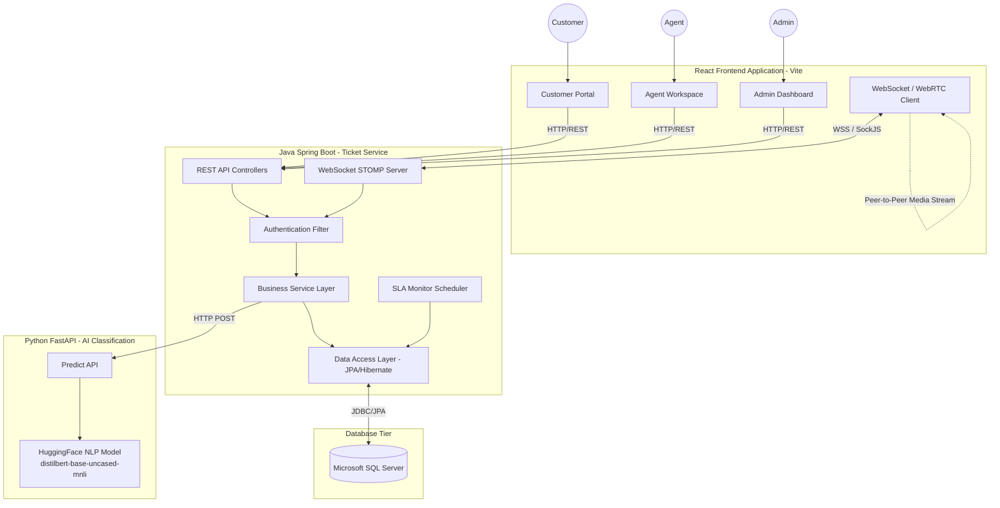
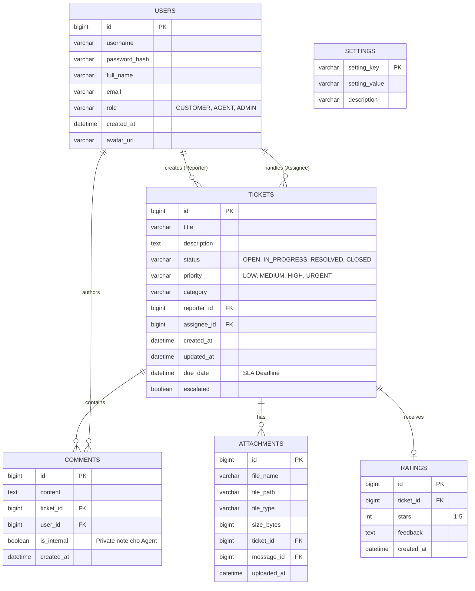
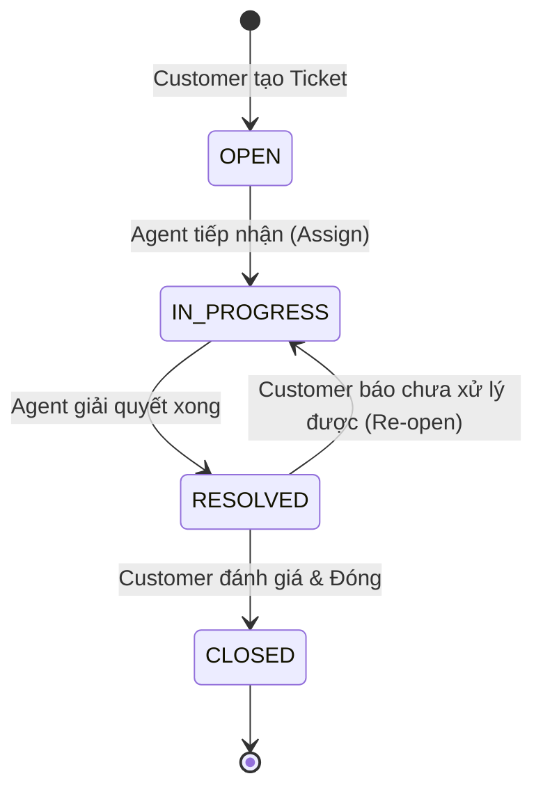
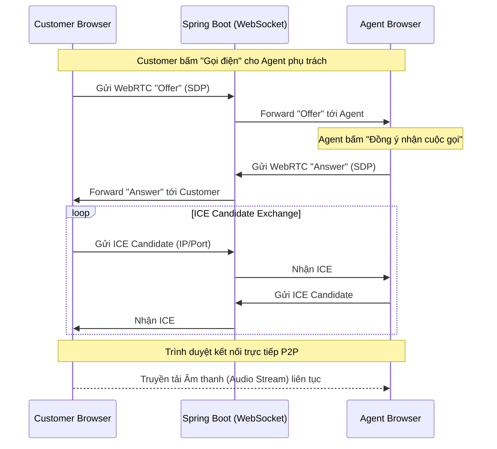

# TÀI LIỆU THIẾT KẾ VÀ KIẾN TRÚC HỆ THỐNG CHI TIẾT
# DỰ ÁN: TICKET MANAGEMENT & SERVICE DESK SYSTEM

---

## CHƯƠNG 1: TỔNG QUAN DỰ ÁN

### 1.1 Bối cảnh và Đặt vấn đề
Trong môi trường doanh nghiệp và hỗ trợ khách hàng hiện đại, việc quản lý các yêu cầu (tickets) từ khách hàng hoặc nhân viên nội bộ đòi hỏi một quy trình xuyên suốt, nhanh chóng và tự động hóa cao. Các hệ thống hỗ trợ truyền thống thường đối mặt với nhiều vấn đề:
*   **Phân loại thủ công:** Khách hàng thường chọn sai danh mục sự cố, dẫn đến việc chuyển nhầm bộ phận (routing) gây lãng phí thời gian.
*   **Thiếu tương tác thời gian thực:** Quá trình trao đổi qua lại thường qua email hoặc các kênh bất đồng bộ, thiếu vắng sự hỗ trợ trực tiếp (Live chat) hoặc gọi thoại (Voice call).
*   **Giao diện cũ kỹ:** Các hệ thống quản trị thường có trải nghiệm người dùng (UX) phức tạp, tốc độ phản hồi chậm do kiến trúc Monolithic (nguyên khối).

### 1.2 Mục tiêu dự án
Dự án **Service Desk System** được khởi tạo nhằm giải quyết triệt để các rào cản trên bằng cách xây dựng một hệ thống theo chuẩn **Microservices**, ứng dụng **Trí tuệ Nhân tạo (AI)** để tự động hóa quy trình phân loại, và cung cấp trải nghiệm **Giao tiếp thời gian thực (Real-time WebRTC & WebSocket)** ngay trên nền tảng Web.

### 1.3 Phạm vi hệ thống
Hệ thống bao gồm 3 phân hệ chính dành cho 3 nhóm đối tượng người dùng:
1.  **Customer Portal:** Dành cho người dùng cuối tạo yêu cầu, theo dõi tiến độ, chat trực tiếp với Agent và đánh giá dịch vụ.
2.  **Agent Workspace:** Môi trường làm việc năng suất cao dành cho nhân viên hỗ trợ, cho phép tiếp nhận ticket, gọi điện WebRTC hỗ trợ từ xa.
3.  **Admin Dashboard:** Bảng điều khiển quản trị toàn diện, theo dõi vi phạm SLA, cấu hình hệ thống động, và quản lý nhân sự.

### 1.4 Yêu cầu phi chức năng (Non-functional Requirements)
*   **Performance (Hiệu năng):** Thời gian phản hồi API (REST) < 200ms. Phản hồi AI < 1.5s.
*   **Scalability (Khả năng mở rộng):** Backend và Frontend tách biệt độc lập (Decoupled), AI Service đóng gói riêng, dễ dàng Scale-out (thêm instance) khi tải tăng cao.
*   **Reliability (Độ tin cậy):** Cơ chế Fallback khi AI Service gặp sự cố; hệ thống vẫn hoạt động bằng Rule-based.
*   **Security (Bảo mật):** Phân quyền Role-based Access Control (RBAC) chặt chẽ tại cả tầng Frontend và API Backend. Mật khẩu mã hóa Bcrypt (giả định trên DB).

---

## CHƯƠNG 2: KIẾN TRÚC HỆ THỐNG (SYSTEM ARCHITECTURE)

### 2.1 Sơ đồ Kiến trúc Tổng thể
Hệ thống áp dụng kiến trúc phân tán. Sự tương tác giữa các service được mô tả trong sơ đồ dưới đây:

### 2.2 Phân tích chi tiết các thành phần (Components Analysis)

#### 2.2.1 Core Backend (Java Spring Boot)
Đây là "trái tim" điều phối toàn bộ nghiệp vụ:
*   **Java 17 & Spring Boot 3.2.4:** Đảm bảo hiệu năng và bảo mật mới nhất.
*   **Spring Data JPA:** Quản lý ánh xạ đối tượng-quan hệ (ORM), giúp giao tiếp với MS SQL Server mà không cần viết SQL thuần.
*   **Spring Web & WebSocket:** Phục vụ HTTP Request và kết nối Socket lâu dài.

#### 2.2.2 AI Service (Python FastAPI)
Tại sao tách AI thành Service riêng thay vì nhúng vào Java?
*   Python là ngôn ngữ số 1 cho Data Science và Machine Learning. Việc cô lập giúp tối ưu hóa thư viện (`PyTorch`, `Transformers`).
*   Khả năng scale độc lập: Xử lý NLP tiêu tốn nhiều CPU/GPU. Có thể scale AI Service riêng rẽ mà không ảnh hưởng chi phí server chạy Backend.
*   Framework **FastAPI** sử dụng kiến trúc bất đồng bộ (ASGI), tốc độ phản hồi cực kỳ ấn tượng, phù hợp làm Microservice.

#### 2.2.3 Web Client (React 19)
*   Xây dựng bằng **Vite** mang lại tốc độ Hot Module Replacement (HMR) tức thì.
*   **TypeScript:** Đảm bảo an toàn kiểu dữ liệu (Type-safe), giảm thiểu bug runtime trong quá trình phát triển hệ thống phức tạp.
*   **TailwindCSS v4:** Utility-first CSS giúp thiết kế giao diện Glassmorphism nhất quán, hỗ trợ Dark Mode tự động dựa trên thẻ `<html class="dark">`.

### 2.3 Mô hình Clean Architecture trong Backend
Backend không viết Code hỗn độn mà tuân thủ nghiêm ngặt **Clean Architecture** (Architecture Onion):

1.  **Presentation Layer (Controllers):** `TicketController.java`, `UserController.java`, `ChatController.java`. Chỉ nhận HTTP Request, gọi logic và trả về HTTP Response. Không chứa nghiệp vụ.
2.  **Service Layer (Business Logic):** `TicketService.java`, `AITicketService.java`. Chứa 100% luật nghiệp vụ (Rules). Xử lý SLA, Validation nâng cao.
3.  **Data Access Layer (Repositories):** `TicketRepository.java`. Các interface kế thừa `JpaRepository`, thực hiện Query dữ liệu.
4.  **Domain/Entities:** Đại diện cho bảng trong Database (`Ticket`, `User`, `Comment`).
5.  **DTOs (Data Transfer Objects):** `TicketCreateRequest`, `TicketResponse`. Lớp ngăn cách giữa Entity (DB) và dữ liệu trả về cho Frontend, giúp giấu các trường nhạy cảm (như password).

---

## CHƯƠNG 3: THIẾT KẾ CƠ SỞ DỮ LIỆU (DATABASE DESIGN)

Hệ thống sử dụng Cơ sở dữ liệu Quan hệ (RDBMS) - **Microsoft SQL Server**. Dưới đây là kiến trúc dữ liệu cốt lõi:

### 3.1 Sơ đồ Thực thể Liên kết (ERD - Entity Relationship Diagram)

### 3.2 Từ Điển Dữ Liệu Chi Tiết (Data Dictionary)

#### 3.2.1 Bảng `USERS`
Bảng trung tâm lưu trữ danh tính. Cột `role` quyết định quyền truy cập ở toàn bộ ứng dụng. 
*Quy chuẩn:* Mật khẩu KHÔNG BAO GIỜ lưu dạng plaintext, sử dụng Hashing (Bcrypt).

#### 3.2.2 Bảng `TICKETS`
*   `reporter_id`: Khóa ngoại trỏ đến `USERS(id)` của người tạo.
*   `assignee_id`: Khóa ngoại trỏ đến `USERS(id)` của nhân viên tiếp nhận (Có thể NULL).
*   `due_date`: Tính toán ngay khi tạo ticket dựa vào Priority (Ví dụ: URGENT -> deadline sau 4 tiếng, LOW -> 48 tiếng). Đây là trái tim của hệ thống SLA.

#### 3.2.3 Bảng `SETTINGS` (Cấu hình động)
Dữ liệu lưu dưới dạng Key-Value (`setting_key`, `setting_value`).
*   Ví dụ: `Key = AI_SERVICE_URL`, `Value = http://localhost:8000/predict`.
*   Việc lưu cấu hình dưới DB giúp Admin đổi cấu hình qua giao diện mà Backend không cần phải Stop/Start lại.

---

## CHƯƠNG 4: THIẾT KẾ BẢO MẬT VÀ PHÂN QUYỀN (SECURITY & RBAC)

### 4.1 Cơ chế Phân quyền (Role-Based Access Control)
Hệ thống sử dụng cơ chế kiểm soát theo nhóm quyền. Bất kỳ request nào từ Client tới Backend đều bị chặn lại ở tầng Filter/Interceptor để kiểm tra ngữ cảnh.

| Chức năng \ Vai trò | CUSTOMER | AGENT | ADMIN |
| :--- | :---: | :---: | :---: |
| **Tạo Ticket** | ✅ | ❌ | ❌ |
| **Xem danh sách Ticket cá nhân** | ✅ | ✅ | ✅ |
| **Xem toàn bộ Ticket hệ thống** | ❌ | ✅ | ✅ |
| **Tiếp nhận Ticket (Assign)** | ❌ | ✅ | ✅ |
| **Chuyển trạng thái Ticket** | ❌ | ✅ | ✅ |
| **Cấu hình hệ thống (Settings)** | ❌ | ❌ | ✅ |
| **Xem Dashboard phân tích SLA** | ❌ | ❌ | ✅ |
| **Đánh giá Ticket (Rating)** | ✅ | ❌ | ❌ |

### 4.2 Thiết kế Bảo mật Tầng API
Thay vì dùng Session stateful, hệ thống thiết kế để hỗ trợ xác thực qua Token/Headers để phù hợp kiến trúc Microservices.
Các Header bắt buộc với các endpoint bảo vệ:
*   `X-User-Id`: ID định danh của người dùng.
*   `X-User-Role`: Vai trò hiện tại (`CUSTOMER`, `AGENT`, `ADMIN`).
*(Lưu ý: Trong hệ thống Product thực tế, các Header này sẽ được trích xuất (decode) từ JWT Token thông qua API Gateway hoặc Filter, hiện tại hệ thống cho phép pass trực tiếp để giả lập mô hình stateless).*

---

## CHƯƠNG 5: PHÂN TÍCH CHI TIẾT CÁC PHÂN HỆ CHỨC NĂNG

### 5.1 Phân hệ Quản lý Yêu cầu (Ticket Engine)

Đây là máy trạng thái (State Machine) cốt lõi của ứng dụng. Vòng đời ticket phải tuân thủ nghiêm ngặt đồ thị sau:

**SLA (Service Level Agreement) Management:**
Hệ thống chứa một Scheduled Task (Cron Job) tên là `SlaMonitorTask` chạy ngầm. 
*   **Logic:** Cứ mỗi phút (hoặc cấu hình được), tiến trình quét toàn bộ Ticket có Status != CLOSED và `due_date` < `CurrentTime`.
*   **Hành động:** Nếu phát hiện vi phạm, bật cờ `escalated = true`. Gửi tín hiệu WebSocket cảnh báo tới nhóm `ADMIN`.

### 5.2 Phân hệ Giao tiếp Thời gian thực (Real-time WebSockets)

Sử dụng giao thức **STOMP qua SockJS** làm chuẩn. Mạng lưới kênh đăng ký (Topic/Queue):
1.  `/topic/tickets`: Kênh Broadcast (Phát thanh) thông báo về mọi sự kiện tạo ticket mới. Chỉ Agent và Admin lắng nghe.
2.  `/topic/ticket/{ticketId}`: Kênh Private của từng Ticket. Khi Customer và Agent cùng mở chi tiết 1 ticket, họ tham gia "Room" này. Mọi bình luận mới sẽ được đẩy tức thì (Live-chat).
3.  `/queue/user/{userId}`: Kênh định tuyến cá nhân. Dùng để gửi thông báo trực tiếp (Ví dụ: "Bạn đã được phân công xử lý Ticket #123").

### 5.3 Phân hệ Gọi thoại (WebRTC Audio Calls)
Tính năng đắt giá nhất của hệ thống, loại bỏ sự phụ thuộc vào ứng dụng ngoài (Zalo, Skype).

**Cơ chế Signaling:**
Hai trình duyệt không thể tự biết IP của nhau do tường lửa/NAT. Backend đóng vai trò là "Kẻ mai mối" (Signaling Server) thông qua WebSocket.

### 5.4 Phân hệ Trí tuệ Nhân tạo (Smart NLP Engine)
Sử dụng AI Service để phân loại (Routing).

1.  **Mô hình Zero-shot:** `distilbert-base-uncased-mnli`. Tại sao lại là Zero-shot? Vì hệ thống Service Desk có thể thay đổi/thêm Category động bất kỳ lúc nào. Mô hình Zero-shot có thể phân loại văn bản vào bất kỳ danh mục nào được cung cấp (Candidate Labels) mà không cần train (huấn luyện) lại Model.
2.  **Quy trình:**
    *   Văn bản đầu vào: "Laptop của tôi bị đen màn hình bật không lên".
    *   Candidate Categories: ["Network", "Hardware", "Software", "Access"].
    *   AI sẽ chấm điểm (Probability Score). Trả lời: `{"category": "Hardware", "confidence": 0.95}`.
3.  **Hệ thống Fallback (Độ tin cậy cao):** Nếu Frontend gọi API Backend, Backend gọi qua AI Service (Python) mà Python bị sập. Backend sẽ tự bắt Exception (TimeOut/ConnectionRefused) và tự động rơi vào khối lệnh **Rule-based**. Ví dụ chứa từ khóa "mạng", "wifi" -> Network. Không bắt được -> "Other". Điều này đảm bảo trải nghiệm khách hàng không bao giờ bị đứt gãy.

### 5.5 Phân hệ Tệp đính kèm (File Management)
*   **Upload Service:** Controller tiếp nhận `MultipartFile`. File được lưu trữ vật lý trên Server Backend tại thư mục được cấu hình (ví dụ: `./uploads/`).
*   **Bảo mật Tệp:** API Download yêu cầu kiểm tra quyền. Tên file được tự động đổi sang UUID để chống trùng lặp, nhưng khi user tải xuống sẽ được map lại về tên file gốc.

---

## CHƯƠNG 6: THIẾT KẾ API VÀ GIAO THỨC TÍCH HỢP

### 6.1 Chuẩn RESTful API
Toàn bộ API được thiết kế tuân theo nguyên tắc REST:
*   Danh từ số nhiều (`/api/tickets`, `/api/users`).
*   Sử dụng đúng HTTP Methods (`GET`, `POST`, `PUT`, `DELETE`, `PATCH`).
*   Response thống nhất cấu trúc: Trả về HTTP Status code chuẩn xác (200 OK, 201 Created, 400 Bad Request, 403 Forbidden, 404 Not Found, 500 Internal Error).

### 6.2 Bảng Danh sách API quan trọng (API Catalog)

| HTTP Method | Endpoint | Chức năng (Description) | Vai trò yêu cầu |
| :--- | :--- | :--- | :--- |
| **POST** | `/api/tickets` | Khách hàng tạo mới 1 Ticket | CUSTOMER |
| **GET** | `/api/tickets` | Lấy danh sách ticket (có phân trang, bộ lọc) | ALL |
| **GET** | `/api/tickets/{id}` | Lấy chi tiết toàn bộ dữ liệu 1 ticket cụ thể | ALL |
| **PATCH** | `/api/tickets/{id}/status` | Cập nhật trạng thái Ticket (ví dụ: sang RESOLVED) | AGENT, ADMIN |
| **POST** | `/api/tickets/{id}/assign` | Agent nhận (Take) ticket cho chính mình | AGENT, ADMIN |
| **POST** | `/api/comments` | Gửi bình luận vào luồng thảo luận ticket | ALL |
| **POST** | `/api/files/upload` | Upload file đính kèm | ALL |
| **POST** | `/api/ai/predict` | (Internal) Phân tích Tiêu đề/Mô tả để dự đoán Category | Backend Call |
| **GET** | `/api/settings` | Lấy cấu hình hệ thống (SLA limits...) | ALL |

---

## CHƯƠNG 7: KIẾN TRÚC FRONTEND (UI/UX)

### 7.1 Công Nghệ Lõi
Dự án sử dụng **React 19** kết hợp **TypeScript**. 
*   **Context API:** Quản lý Global State. `AuthContext` quản lý thông tin User đăng nhập và Role. `WebSocketContext` quản lý 1 kết nối duy nhất từ Client đến Server, tránh mở nhiều kết nối tốn tài nguyên.
*   **Lucide-React:** Sử dụng bộ icon SVG siêu nhẹ, sắc nét và hiện đại.

### 7.2 Định tuyến bảo mật (Protected Routing)
Sử dụng thư viện Router để bọc các trang. Component `RoleRoute` nhận vào danh sách `allowedRoles`. Nếu người dùng truy cập một Route mà Role không khớp, hệ thống tự động redirect về màn hình Unauthorized hoặc Login.
*   `/my-tickets` -> Chỉ `CUSTOMER`.
*   `/workspace` -> Chỉ `AGENT`.
*   `/admin/*` -> Chỉ `ADMIN`.

### 7.3 Triết lý Thiết kế Giao diện (UI/UX)
*   **Glassmorphism (Kính mờ):** Giao diện Premium, sử dụng hiệu ứng `backdrop-blur` kết hợp với màu nền bán trong suốt `bg-white/10` hoặc `bg-gray-800/50`. Tạo cảm giác phần mềm hiện đại, không bị nhàm chán như các bảng biểu truyền thống.
*   **Micro-interactions:** Hiệu ứng hover nhịp nhàng (`transition-all duration-300`, `hover:scale-105`) tạo cho hệ thống sự sống động và phản hồi tức thì với hành động của user.
*   **Dark Mode Native:** Tích hợp Dark Mode toàn diện ngay từ gốc bằng TailwindCSS classes (`dark:bg-slate-900`, `dark:text-white`).

---

## CHƯƠNG 8: TỔNG KẾT VÀ HƯỚNG PHÁT TRIỂN TƯƠNG LAI

Hệ thống **Microservices Service Desk** hiện tại đã đặt một nền móng công nghệ cực kỳ vững chắc. Với kiến trúc phân tán (Backend - AI - Frontend riêng biệt), hệ thống sẵn sàng mở rộng cả về chiều ngang lẫn chức năng.

**Tầm nhìn phát triển giai đoạn (Phase 2):**
1.  **AI Auto-Resolution Chatbot:** Nâng cấp AI Service tích hợp RAG (Retrieval-Augmented Generation) kết nối với Knowledge Base. Khách hàng nhắn lỗi -> AI tự sinh câu trả lời hướng dẫn khắc phục -> Giảm 40% lượng ticket tới tay Agent.
2.  **Omnichannel Ticket Generation:** Tích hợp Webhook kết nối Zalo OA, Fanpage Facebook, Telegram. Bất cứ tin nhắn nào của khách hàng qua Mạng xã hội đều lập tức quy đổi thành 1 Ticket chung trên hệ thống.
3.  **Smart Load Balancing Assignment:** Nâng cấp thuật toán ở Backend. Thay vì Agent tự gắp ticket, hệ thống tự đếm số lượng ticket đang *In_Progress* của từng Agent, tính toán năng lực và tự động (Auto-Assign) cho Agent rảnh nhất.
4.  **Advanced Metric Dashboards:** Áp dụng hệ thống BI (Business Intelligence) mini ngay trên Admin Dashboard, xuất báo cáo động bằng các Pivot Table Excel.

*Tài liệu này được soạn thảo cung cấp độ sâu tối đa về thiết kế hệ thống, minh bạch hóa toàn bộ quy trình công nghệ bên dưới ứng dụng Service Desk System.*
