# Danh sách 15 Sơ đồ DFD (Data Flow Diagram) - Hệ thống Service Desk

Dưới đây là 15 sơ đồ luồng dữ liệu (DFD) được thiết kế chuyên nghiệp bằng cú pháp **PlantUML**, tương thích hoàn toàn với Draw.io. Các sơ đồ tuân thủ thiết kế đồng bộ (Font Times New Roman, màu sắc quy chuẩn, bo góc 25) để phù hợp với tài liệu dự án của bạn.

---

## 1. DFD Mức 0 (Context Diagram) - Tổng quan Hệ thống
Mô tả các thực thể bên ngoài (External Entities) tương tác với toàn bộ Hệ thống Service Desk.

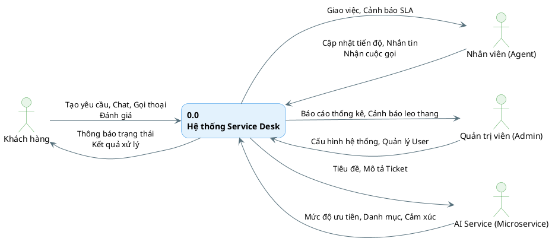

---

## 2. DFD Mức 1 - Tổng quát Hệ thống
Phân rã Hệ thống thành các Tiến trình (Process) chính và các Kho dữ liệu (Data Stores).

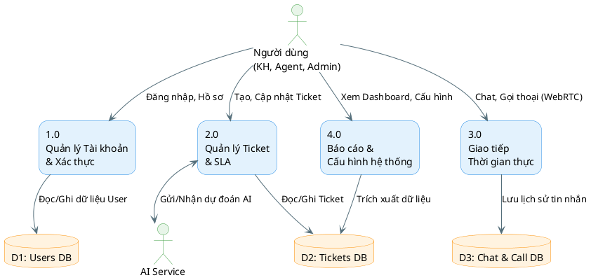

---

## 3. DFD Mức 2 (Tiến trình 1.0) - Quản lý Tài khoản & Xác thực
Chi tiết quá trình phân quyền (RBAC) và quản lý người dùng.

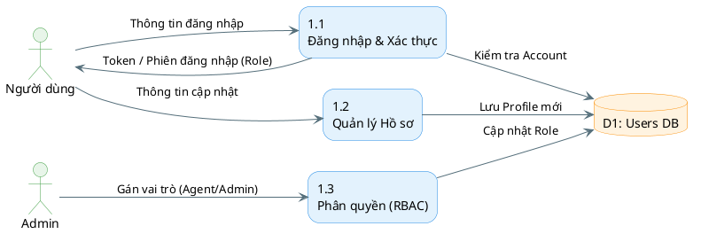

---

## 4. DFD Mức 2 (Tiến trình 2.1) - Khởi tạo Yêu cầu & Phân loại AI
Chi tiết quá trình khách hàng tạo Ticket và tích hợp tự động phân loại bằng AI.

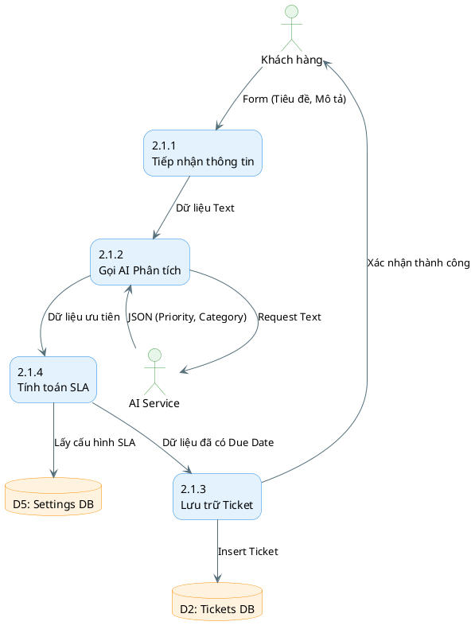

---

## 5. DFD Mức 2 (Tiến trình 2.2) - Tiếp nhận & Xử lý Yêu cầu
Quá trình Agent làm việc với Ticket, cập nhật trạng thái.

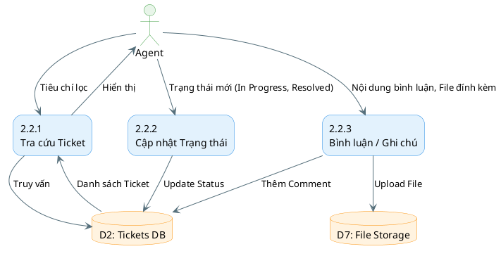

---

## 6. DFD Mức 2 (Tiến trình 2.3) - Đánh giá & Phản hồi
Khách hàng đánh giá mức độ hài lòng sau khi Ticket được đóng.

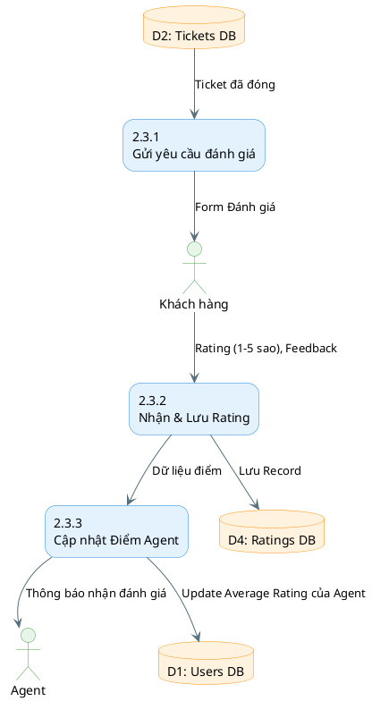

---

## 7. DFD Mức 2 (Tiến trình 3.1) - Giao tiếp Chat & Nhắn tin
Luồng truyền tải tin nhắn thời gian thực qua WebSockets (STOMP).

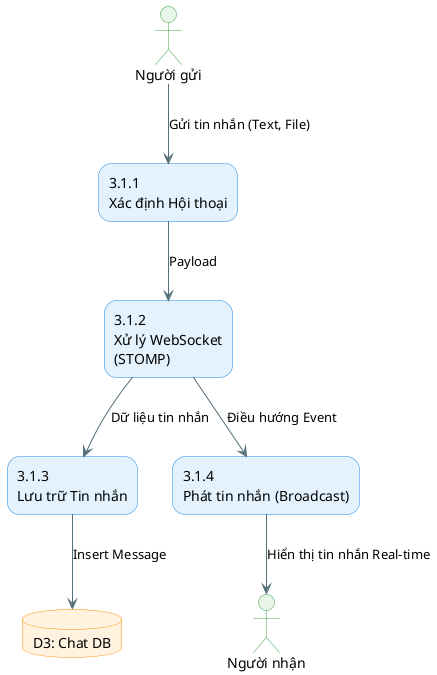

---

## 8. DFD Mức 2 (Tiến trình 3.2) - Gọi thoại WebRTC (Audio Call)
Quá trình thiết lập cuộc gọi P2P giữa Khách hàng và Agent.

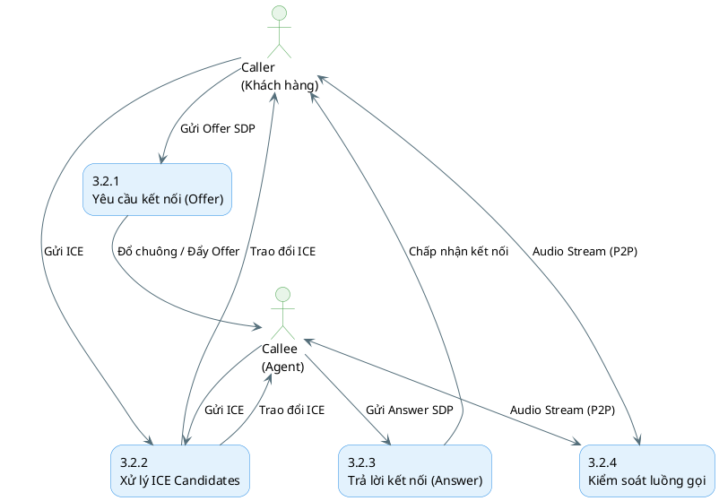

---

## 9. DFD Mức 2 (Tiến trình 5.0) - Giám sát SLA & Leo thang
Tiến trình chạy ngầm quét các ticket vi phạm hạn chót xử lý.

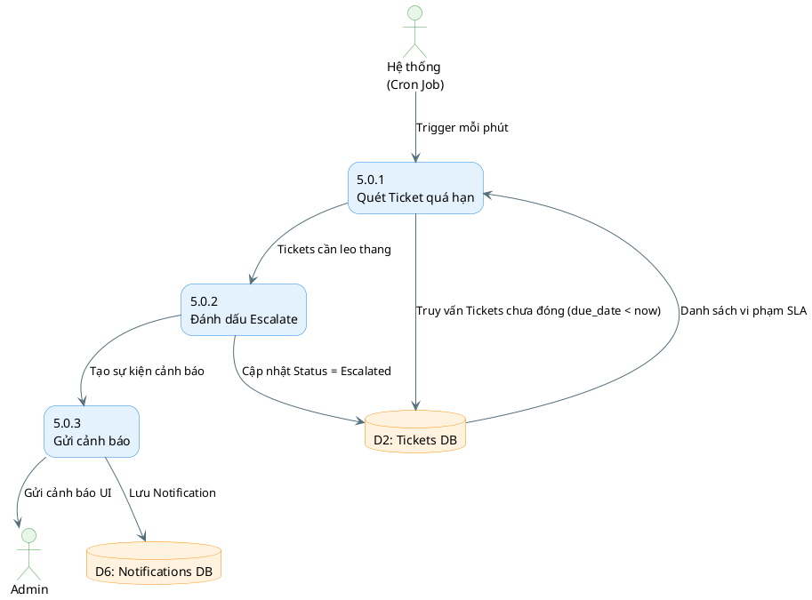

---

## 10. DFD Mức 2 (Tiến trình 4.1) - Quản lý Cấu hình Hệ thống
Admin thay đổi các tham số động của hệ thống (SLA, AI URL).

```plantuml
@startuml
skinparam defaultFontName "Times New Roman"
skinparam rectangle {
    BackgroundColor #E3F2FD
    BorderColor #1E88E5
    RoundCorner 25
}
skinparam database {
    BackgroundColor #FFF3E0
    BorderColor #FB8C00
}
skinparam actor {
    BackgroundColor #E8F5E9
    BorderColor #43A047
}
skinparam arrowColor #546E7A

actor "Admin" as AD

rectangle "4.1.1\nHiển thị cấu hình" as P411
rectangle "4.1.2\nCập nhật tham số" as P412
rectangle "4.1.3\nÁp dụng Runtime" as P413

database "D5: Settings DB" as D5

AD --> P411 : Yêu cầu xem Settings
D5 --> P411 : Trả về dữ liệu
P411 --> AD : Hiển thị form

AD --> P412 : Gửi giá trị mới (SLA, AI URL)
P412 --> D5 : Lưu cấu hình
P412 --> P413 : Reload Config
P413 --> Hệ thống : Cập nhật biến môi trường/Cache
@enduml
```

---

## 11. DFD Mức 2 (Tiến trình 4.2) - Dashboard & Báo cáo
Tổng hợp dữ liệu và xuất báo cáo hiệu suất hoạt động.

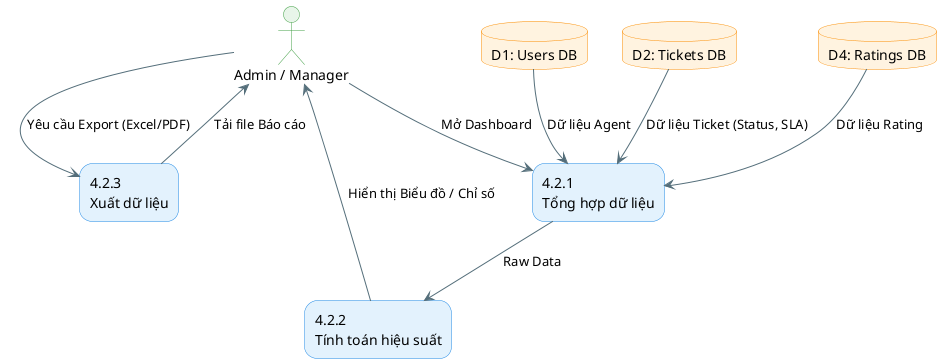

---

## 12. DFD Mức 3 (Tiến trình 2.1.2) - Chi tiết Giao tiếp Microservice AI
Sự trao đổi luồng dữ liệu chuyên sâu giữa Backend Java và AI Python.

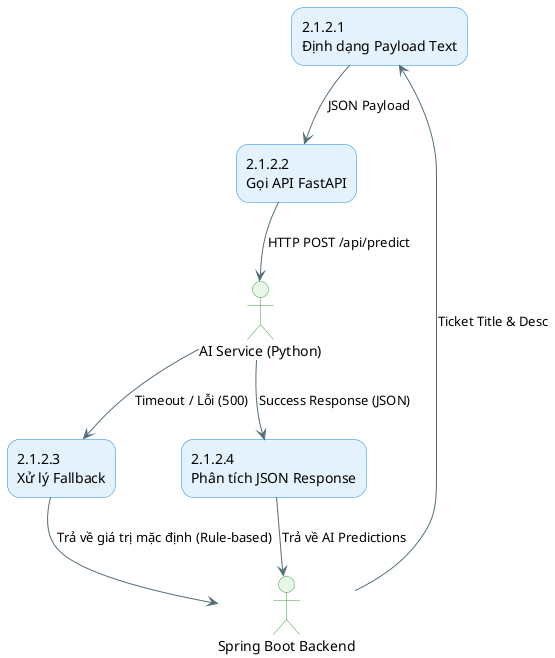

---

## 13. DFD Mức 3 (Tiến trình 3.1.3) - Chi tiết Hệ thống Thông báo (Notifications)
Luồng sự kiện đẩy thông báo real-time tới giao diện.

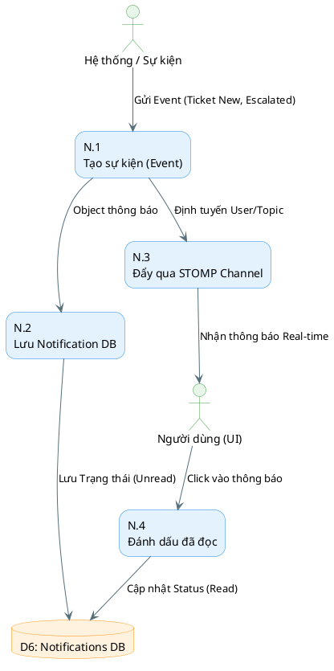

---

## 14. DFD Mức 3 (Tiến trình 2.4) - Chi tiết Quản lý File Đính kèm
Cách file đính kèm được upload, lưu trữ và mapping với Database.

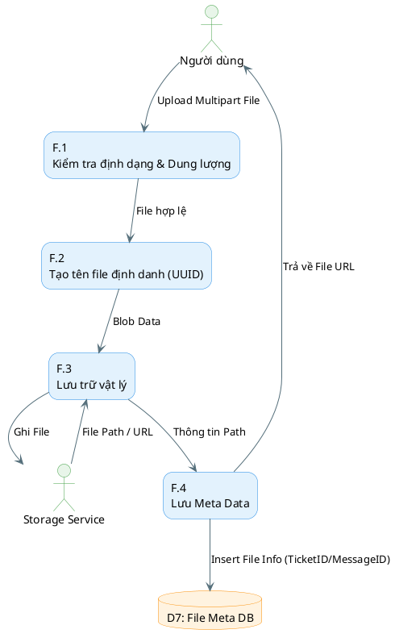

---

## 15. DFD Mức 3 (Tiến trình 2.2.x) - Chi tiết Phân công Ticket (Assignment)
Logic hệ thống quyết định gán Ticket cho Agent nào.

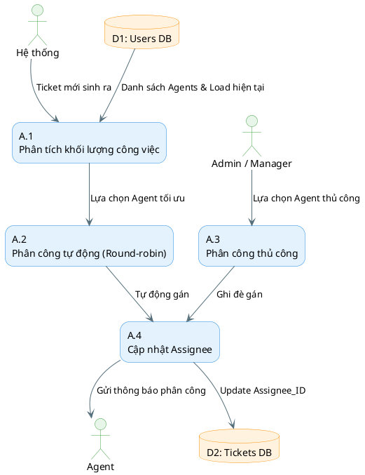
