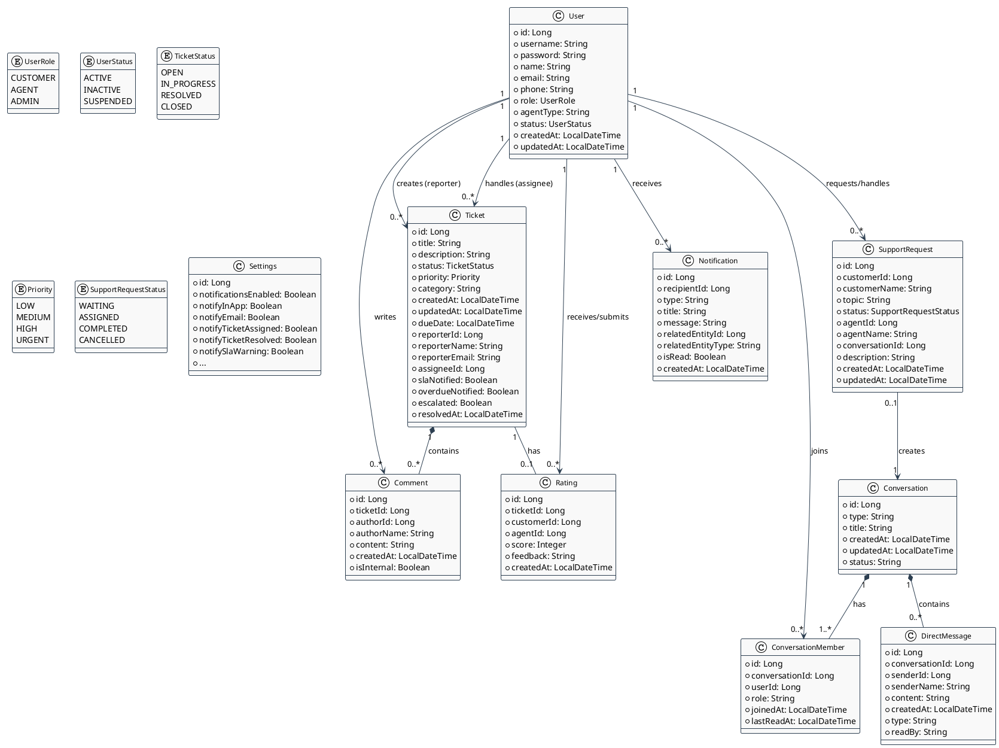

# Sơ đồ Lớp (Class Diagram) - Hệ thống Service Desk

Tài liệu này bao gồm sơ đồ lớp (Class Diagram) của hệ thống Service Desk, thể hiện cấu trúc các thực thể dữ liệu (Entities) và các mối quan hệ (Associations) giữa chúng trong cơ sở dữ liệu.

Sơ đồ được viết bằng cú pháp PlantUML. Bạn có thể copy mã nguồn này và dán vào [Draw.io](https://app.diagrams.net/) (vào mục **Arrange > Insert > Advanced > PlantUML...**) hoặc xem trực tiếp bằng các plugin hỗ trợ PlantUML.

## Sơ đồ Lớp Tổng Quan (Core Entities)

Sơ đồ này mô tả cấu trúc dữ liệu tổng quan bao gồm Quản lý Người dùng, Ticket, Giao tiếp (Tin nhắn, Bình luận) và các cấu hình liên quan.

## Diễn giải chi tiết

1.  **User (Người dùng):** Thực thể trung tâm quản lý tài khoản, thông tin cá nhân và quyền truy cập (`UserRole`). `User` liên kết trực tiếp với nhiều thực thể khác như người tạo (reporter) hoặc người xử lý (assignee) `Ticket`, người viết `Comment`, v.v.
2.  **Ticket (Yêu cầu hỗ trợ):** Quản lý toàn bộ vòng đời của một yêu cầu. Bao gồm các trạng thái (`TicketStatus`), mức độ ưu tiên (`Priority`) và các thông tin SLA (`dueDate`, `escalated`). Một `Ticket` có thể chứa nhiều `Comment` và một `Rating` (Đánh giá) duy nhất khi đóng.
3.  **Comment (Bình luận):** Cấu trúc lưu trữ quá trình trao đổi trực tiếp trên một `Ticket`. Có thuộc tính `isInternal` để dành riêng cho Agent trao đổi nội bộ.
4.  **Rating (Đánh giá):** Phản hồi và chấm điểm (score) của khách hàng về chất lượng phục vụ của Agent.
5.  **Hệ thống Giao tiếp (Conversation, ConversationMember, DirectMessage):** Xử lý nhắn tin thời gian thực. `Conversation` là phòng chat hoặc luồng tin nhắn, bao gồm các thành viên (`ConversationMember`) tham gia và lưu lại lịch sử nội dung (`DirectMessage`).
6.  **SupportRequest:** Yêu cầu hỗ trợ trực tuyến thông qua Chat hoặc Call, sẽ tự động sinh ra một `Conversation` tương ứng để tương tác.
7.  **Notification:** Hệ thống thông báo đẩy, cảnh báo SLA, có quan hệ đến các thực thể khác qua `relatedEntityId` và `relatedEntityType` (Đa hình ảo).
8.  **Settings:** Cấu hình hệ thống chung (thường chỉ có 1 bản ghi duy nhất) phục vụ tắt/bật tính năng thông báo và SLA.
